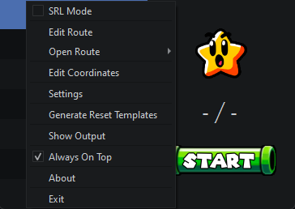
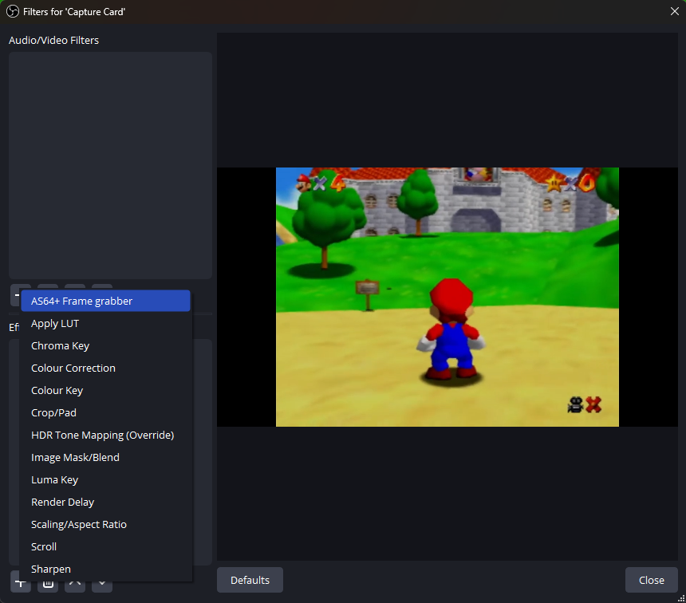
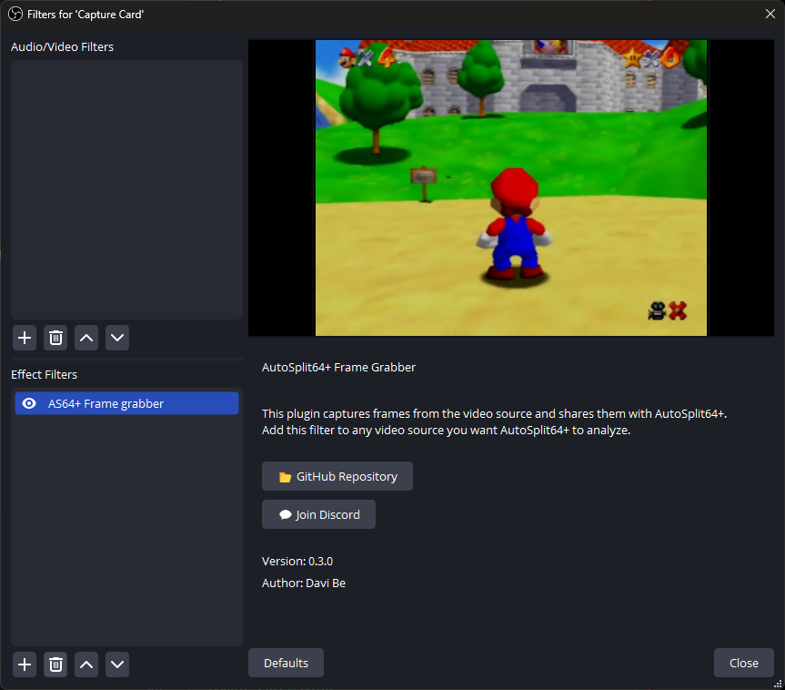
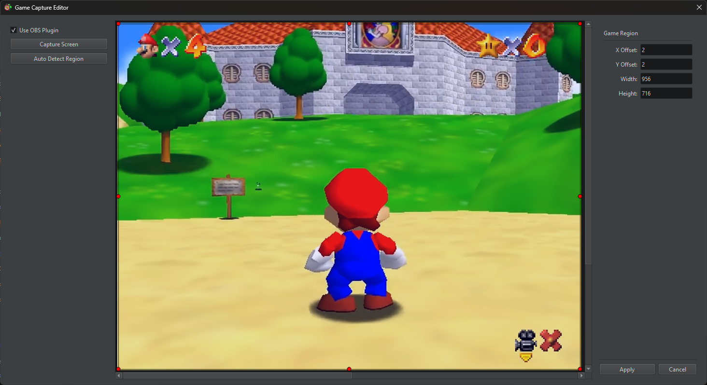
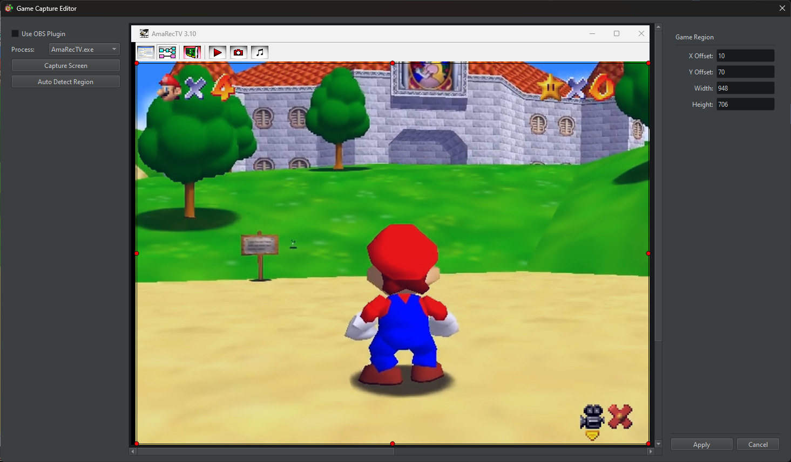

<h1 align="center"> AutoSplit64++ </h1><br>
<p align="center">
    
</p>

## Introduction
AutoSplit64++ automates splitting for Super Mario 64 speedruns on console. It watches your captured gameplay and controls LiveSplit or LiveSplit One: it splits, undoes and resets the timer for you.

It is a fork of [AutoSplit64+](https://github.com/DaviBe92/AutoSplit64plus), which is an enhanced fork of [AutoSplit64](https://github.com/Kainev/AutoSplit64). AutoSplit64++ adds:
- macOS (Apple Silicon) support, capturing a video device (capture card, OBS Virtual Camera) or a window
- Streamed window capture on Windows, which keeps working while the window is covered
- LiveSplit One support
- Updates from GitHub releases, from inside the app
- Themes and a resizable window

## Key Features
### Core Functionality
- Automatic split timing
- Console reset detection
- Star count detection
- DDD entry, Final star, X-Cam and Death detection
- Custom route creation
- LiveSplit `.lss` file import

### Capture and Setup
- **OBS Plugin** (Windows): captures your capture card source in OBS before scaling, overlays or scene switches are applied
- **Window Capture**: streams the window of your capture software or emulator, also while it's covered by other windows
- **Video Device** (macOS): captures a capture card, the OBS Virtual Camera or a webcam
- **Automatic LiveSplit connection**: no need to start the LiveSplit Server yourself
- **Autostart**: start split detection when AutoSplit64++ opens. It keeps trying to connect to LiveSplit and the game capture for up to 5 minutes, so AutoSplit64++ can run entirely in the background
- **Improved recognition**: better star detection, tolerant of a slightly inaccurate capture region, and automatic capture region detection

## System Requirements
- Windows 10 version 1903 or newer, or macOS on Apple Silicon
- LiveSplit 1.8.29 or newer, or [LiveSplit One](https://one.livesplit.org)
- A capture device/card, or an emulator
- For the OBS Plugin: OBS Studio 31 or newer on Windows

## Quick Setup

1. Download the latest [Release](https://github.com/florence-wolfe/AutoSplit64plusplus/releases) for your platform.
2. Windows: extract the zip and run `AutoSplit64++.exe`. macOS: see [Installing on macOS](#installing-on-macos).
3. Set your timer to start at 1.36 seconds (see [LiveSplit](#livesplit)).
4. Choose what to capture and set the game region (see [Game Capture](#game-capture)).
5. Generate Reset Templates (`Right-Click -> Generate Reset Templates`).
6. Load or create your route (see [Routes](#routes)).
7. Press Start.

### Installing on macOS

1. Open the downloaded zip and drag `AutoSplit64++.app` into your `Applications` folder.
2. Open AutoSplit64++. The first time, macOS says it can't verify that AutoSplit64++ is free of malware and doesn't open it, because AutoSplit64++ isn't signed by a registered Apple developer. Click `Done`.
3. Open `System Settings -> Privacy & Security`, scroll down to `Security`, where it says AutoSplit64++ was blocked, and click `Open Anyway`. Confirm with your password or Touch ID, then click `Open`.

On macOS 14 and earlier, you can instead Control-click (or right-click) the app, choose `Open`, and confirm.

Alternatively, remove the flag macOS puts on downloaded files in Terminal, which only makes sense for apps you trust:

```
xattr -dr com.apple.quarantine /Applications/AutoSplit64++.app
```

This is only needed once for each version you download yourself: updates installed by AutoSplit64++ open without it. If you open AutoSplit64++ before moving it, it offers to move itself to Applications: until it's moved, macOS may run it from a temporary read-only copy, where updates can't be installed. Choose `Don't Ask Again` if you keep it elsewhere on purpose.

AutoSplit64++ stores its settings, log, routes and reset templates in `~/Library/Application Support/AutoSplit64++/`. Installing a new version keeps them.

### Interface

All windows and options are in the right-click menu, which the menu button (☰) in the bottom right corner also opens. On macOS, the same menu is also available as `Options` in the menu bar:



- **Edit Route** / **Open Route**: edit the current route, or switch to another one
- **Edit Coordinates**: choose what to capture and where the game is in it
- **Settings**: connection to LiveSplit, detection thresholds, theme and other settings
- **Generate Reset Templates**: record what a console reset looks like in your capture
- **Show Output**: show what split detection sees: fades, X-Cams and star predictions
- **Autostart**: start split detection when AutoSplit64++ opens
- **SRL Mode**: don't reset the timer when you reset the console, e.g. in races

The look of the whole app can be changed in `Settings -> General -> Theme`.

## Usage Guide

### LiveSplit

AutoSplit64++ can control LiveSplit in three ways, chosen in `Settings -> Connection -> Connection Mode`:
- **Named Pipe** (Windows only, the default there): connects to LiveSplit directly. There is no need to start the LiveSplit Server.
- **TCP**: connects to the LiveSplit Server at the host and port you set (`localhost:16834` by default). Start the server in LiveSplit first (`Right-Click LiveSplit -> Control -> Start Server`).
- **LiveSplit One** (the default on macOS): see [LiveSplit One](#livesplit-one).

The dot in the top right corner shows the connection to LiveSplit: green while split detection is connected, grey until it starts, and red if connecting failed. Hover it for the address, and click it to copy the address.

AutoSplit64++ recognizes a reset only when the Super Mario 64 logo appears, so the timer has to start at 1.36 seconds:

In LiveSplit `Right-Click -> Edit Splits...` &rarr; Set `Start Timer at:` to **1.36**

#### LiveSplit One

AutoSplit64++ can also control [LiveSplit One](https://one.livesplit.org) (the web timer):

1. In AutoSplit64++, `Settings -> Connection` &rarr; set `Connection Mode` to **LiveSplit One**. It listens on port `16835` by default. The dot in the top right corner shows the server state (green: connected, amber: waiting for LiveSplit One, red: could not start). Hover it for the URL and click it to copy the URL.
2. In LiveSplit One, `Settings -> Server Connection -> Connect` &rarr; enter `ws://localhost:16835`.
3. Click `OK` to leave LiveSplit One's settings. LiveSplit One ignores timer commands while its settings are open.

In LiveSplit One, `Splits -> Edit` &rarr; Set `Start Timer at` to **1.36**.

### Game Capture

What AutoSplit64++ captures is set in the Capture Editor (`Right-Click -> Edit Coordinates`). The options depend on your platform:

| | Windows | macOS |
|---|---|---|
| Capture card through OBS | **OBS Plugin** (*preferred*) | **Video Device** with the OBS Virtual Camera |
| Capture card without OBS | **Window** of your capture software (e.g. AmaRecTV) | **Video Device** |
| Emulator | **Window** | **Window** |

Whichever you choose, set the game region the same way afterwards (see [Setting the Game Region](#setting-the-game-region)).

#### OBS Plugin (Windows)

The AS64+ Frame Grabber OBS plugin sends the gameplay of your capture card source directly to AutoSplit64++, before anything else is done to it. Resizing the source, switching scenes, adding effects or overlays, etc. don't affect what AutoSplit64++ sees.

##### Install the Plugin:
- Close OBS.
- Copy `autosplit64plus-framegrabber.dll` from the `obs-plugin` folder next to `AutoSplit64++.exe` to your OBS plugin folder, usually `C:\Program Files\obs-studio\obs-plugins\64bit`.
- Open OBS.
- Open the Filters of your capture card source (`Right-Click -> Filters`).
- Add (+) an Effect Filter and choose `AS64+ Frame grabber`.




- If the source has other filters, make sure `AS64+ Frame grabber` is at the very top.
- Close the Filters.

##### Set up AutoSplit64++:
- Open the Capture Editor (`Right-Click -> Edit Coordinates`).
- Check `Use OBS Plugin`.
- [Set the game region](#setting-the-game-region).



#### Window Capture (Windows)
Window Capture streams the selected program's window with Windows.Graphics.Capture (the API used by screen sharing apps and OBS), also while the window is covered by other windows. It needs Windows 10 version 1903 or newer; on older versions it takes a screenshot of the window 30 times/second instead.

- Open your capture software (e.g. AmaRecTV) or emulator. The window can be covered, but not minimized.
- Open the Capture Editor (`Right-Click -> Edit Coordinates`).
- Uncheck `Use OBS Plugin`.
- Select the program in the `Process` drop-down.
- [Set the game region](#setting-the-game-region).



Good to know:
- On Windows 10, Windows draws a yellow border around a window while it's captured. Windows 11 lets AutoSplit64++ turn it off.
- The whole window is captured, where versions before AutoSplit64++ cut it off at the bottom and right, so its framing may differ slightly. If you set up your game region with an earlier version, check that it still covers only the game.
- Capturing the OBS window itself isn't recommended: it captures OBS's preview, with your overlays, at whatever size the preview has. Use the OBS Plugin instead.
- With AmaRecTV at 100% window size (`Right-Click AmaRecTV -> 100%`), the default region should already be right.

#### Capture on macOS
On macOS, the Capture Editor's `Source` chooses what to capture. Each source needs its own permission, and the editor only asks for the one of the selected source. While it's missing, the editor shows a button that asks macOS for it, and an `Open System Settings` button in case it was denied before. When running from source, the permissions are for your terminal app instead.

**Video Device** captures a capture card, the OBS Virtual Camera or a webcam. Select it in the `Device` drop-down. It needs the Camera permission.
- With the OBS Virtual Camera, set its output to your capture card source rather than the program output (OBS 30 or newer: the gear next to `Start Virtual Camera`). Otherwise overlays and scene switches show up in the capture.

**Window** streams the emulator window directly with ScreenCaptureKit (the same API used by screen sharing apps), so neither OBS nor a virtual camera is needed. It needs the Screen Recording permission; restart AutoSplit64++ after allowing it if the editor doesn't pick it up.
- The window can be behind other windows, but not minimized.
- Select your emulator in the `Process` drop-down. The capture leaves out the window's title bar, like on Windows. If you set up your game region with an earlier version, set it again and generate new reset templates; starting asks you to.
- Don't resize the emulator window after setting the region. If you do, set the region again.

The OBS Plugin is Windows-only.

#### Setting the Game Region
In the Capture Editor:
- Press `Capture Screen` to update the shown frame. Make sure it shows a bright scene, like the screenshots above.
- Press `Auto Detect Region` to position the game region selector around the game. This works best with the OBS Plugin and AmaRecTV.
- If the region isn't right, adjust it by hand as accurately as you can. When in doubt, select 1-2 pixels into the game: even 1 pixel outside the game area causes issues!
- `VC fix (experimental)` increases the contrast for the Virtual Console, at the cost of some latency.
- Press `Apply` to save.

### Routes

AutoSplit64++ needs to know when you want to split. Set this up in the Route Editor (`Right-Click -> Edit Route`), which looks and works like LiveSplit's split editor.

A regular split triggers when the specified number of stars has been collected, and a set number of fadeouts or fadeins has occurred since the star count was reached or since the last split. Every time a star is collected, or a split, undo or skip is triggered, the fadeout and fadein counts are reset to 0.

**The easiest way to create a route is to import the splits you use in LiveSplit: press `Open` in the Route Editor and select your `.lss` file. AutoSplit64++ fills in as many details as it can, but check each split to make sure it's correct.**

`Right-Click -> Open Route` switches between the routes in the `routes` folder, or opens one from a file.

### Updates
The installed version is shown at the bottom, next to the menu button. Click it to check for an update. With `Check for Updates` on (in `Settings -> General`), AutoSplit64++ also checks when it opens and offers a new version, and a green dot appears next to the version: click it to update.

Updating downloads the new version, checks it, and installs it either right away (AutoSplit64++ restarts) or when you quit. Split detection has to be stopped before updating, in case you're in a run. Your settings, routes and reset templates are kept.

On macOS, each new version needs the Screen Recording and Camera permissions again, as it isn't signed by an Apple developer account.

## Troubleshooting

If you encounter any issues, please run through all steps below.

- Check the capture and game region are correct (`Right-Click -> Edit Coordinates`)
- Check the dot in the top right corner. When using the TCP connection, make sure the LiveSplit Server is running (`Right-Click LiveSplit -> Control -> Start Server`)
- Check the correct route is loaded, and that it's accurate (e.g. correct star counts, fadeout/fadein counts)
- Make sure SRL Mode (`Right-Click -> SRL Mode`) is off if you want AutoSplit64++ to detect console resets
- Generate reset templates (`Right-Click -> Generate Reset Templates`)
- Use `Right-Click -> Show Output` to see what split detection sees
- Enlarge your game capture window if it is very small
- Make sure your capture's colour settings (e.g. saturation) are default or close to default
- If using an unpowered splitter, compare the whiteness of your star select screens to other players. If it is extremely dull you may need to increase your capture brightness
- Make sure your capture is set to a 4:3 aspect ratio (or close to it)

## Development
AutoSplit64++ uses [uv](https://docs.astral.sh/uv/) to manage Python and its dependencies. [Install uv](https://docs.astral.sh/uv/getting-started/installation/), then run these from the repository. uv sets up Python 3.12 and the dependencies from `uv.lock` the first time.

- Start AutoSplit64++: `uv run python -m autosplit64`
- Run the tests: `uv run python -m unittest`
- Replay recorded runs in the tests: `uv run python -m tests.replay` downloads the videos of the runs in `tests/recordings` into `tests/recordings/cache` with yt-dlp. The tests then replay them through split detection and check its splits against the runner's, which takes about a minute. Without the videos, these tests are skipped.
- Add or update a dependency: `uv add <package>`, which updates `pyproject.toml` and `uv.lock`

The code is in `src/autosplit64`: `core` (capture, LiveSplit connections, config, updates), `logic` (split detection), and `gui` (the windows and dialogs).

### Releases
Releases are versioned by their git tag. Pushing a tag like `v0.4.0` runs the tests and builds the macOS app and the Windows app on GitHub Actions, then publishes them as a GitHub release, with a `SHA256SUMS` file for the updater:

```
git tag v0.4.0
git push origin v0.4.0
```

Tags with a suffix, like `v0.4.0-rc.1`, are published as pre-releases, which the app doesn't offer as updates.

### Building
Run `uv run build.py` on the platform you're building for:
- Windows: creates `dist/AutoSplit64++/` with `AutoSplit64++.exe`. Keep the exe together with the other files in that folder.
- macOS: creates `dist/AutoSplit64++.app`. Move it to `Applications` (or anywhere else) to install it.

### Building the OBS Plugin
The plugin's source is in `obs-plugin`. On Windows, with CMake and Visual Studio 2022:

```
cd obs-plugin
cmake --preset windows-x64
cmake --build --preset windows-x64
```

This creates `obs-plugin/build_x64/RelWithDebInfo/autosplit64plus-framegrabber.dll`. Build it before `build.py`, which copies it into `dist/AutoSplit64++/obs-plugin`. Configuring downloads the OBS sources and dependencies the plugin builds against. The release workflow builds the plugin too, so every Windows release includes it.

## Credits
Flo Wolfe - AutoSplit64++

[Davi Be](https://github.com/DaviBe92) - [AutoSplit64+](https://github.com/DaviBe92/AutoSplit64plus)

Synozure - [AutoSplit64](https://github.com/Kainev/AutoSplit64)

Gerardo Cervantes - [Star Classifier](https://github.com/gerardocervantes8/Star-Classifier-For-Mario-64)

[Kitsovereign](https://twitter.com/kitsovereign) - Route icons

## TODO

See [TODO.md](TODO.md).
